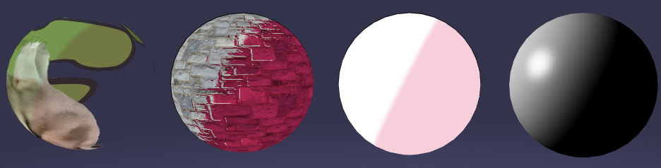

# babylon-mtoon-material

[](https://badge.fury.io/js/babylon-mtoon-material) [](https://circleci.com/gh/virtual-cast/babylon-mtoon-material) [](https://github.com/semantic-release/semantic-release)



[Unity Santarh/MToon Shader](https://github.com/Santarh/MToon/) WebGL porting to [babylon.js](https://www.babylonjs.com/).

Some settings will be ignored or generates inconsistent lighting.

[About MToon](https://vrm.dev/en/univrm/shaders/shader_mtoon)([ja](https://vrm.dev/univrm/shaders/shader_mtoon)

## Supported version table

|babylon.js version|babylon-mtoon-material version|
|---|---|
|~4.0.0|^1.0.0|
|~4.1.0|^2.0.0|
|~4.2.0|^3.0.0|
|~5.0.0-rc.0|^4.0.0|
|^5.19.0|^5.0.0|

## Features

- Some [StandardMaterial](https://doc.babylonjs.com/typedoc/classes/BABYLON.StandardMaterial) abilities
    - Lighting
    - Multiview
    - LogarithmicDepth
    - Fog
    - Bones in shader
    - MorphTargets in shader
    - Shadow
    - EffectFallback
    - Instances
    - ClipPlane
    - AmbientColor
    - Alpha CutOff
- Textures & Color values
    - Diffuse
    - Emissive
    - Bump
    - Shade(shaded diffuse rate with red channel)
    - Receive Shadow(received shadow rate with red channel)
    - Shading Grade(shading grade rate with red channel)
    - Rim
    - MatCap
    - Outline Width(outline width rate with red channel)
- UV Animation(Scroll, Rotation)
- Serialize Support

These are not covered.

- Specular
- Vertex Color
- PrePass

## Usage

This material will be automatically assined to VRM/VCI model within [babylon-vrm-loader](https://github.com/virtual-cast/babylon-vrm-loader).

Also you can explicitly assign MToonMaterial to any meshes.

### Browser

Live preview at CodePen is [here](https://codepen.io/akai_inu/pen/EBwGxE).

```html
<!DOCTYPE html>
<html>
    <head>
        <title>Babylon.js MToon Material</title>
        <meta charset="utf-8">
        <meta name="viewport" content="width=device-width, user-scalable=no">
    </head>
    <body>
        <main id="wrapper">
            <canvas id="renderCanvas"></canvas>
        </main>
        <script src="https://preview.babylonjs.com/babylon.max.js"></script>
        <script src="https://unpkg.com/babylon-mtoon-material/dist/index.js"></script>
        <script>
            // example usage from https://github.com/BabylonJS/Babylon.js
            const canvas = document.getElementById('renderCanvas');
            const engine = new BABYLON.Engine(canvas, true, {preserveDrawingBuffer: true, stencil: true});
            const scene = new BABYLON.Scene(engine);
            const camera = new BABYLON.FreeCamera('camera1', new BABYLON.Vector3(0, 5, -10), scene);
            camera.setTarget(BABYLON.Vector3.Zero());
            camera.attachControl(canvas, false);
            new BABYLON.HemisphericLight('light1', new BABYLON.Vector3(0, 1, 0), scene);
            const sphere = BABYLON.Mesh.CreateSphere('sphere1', 16, 2, scene, false, BABYLON.Mesh.FRONTSIDE);
            sphere.position.y = 1;

            // Assign MToonMaterial
            sphere.material = new MToonMaterial('mat1', scene);

            engine.runRenderLoop(function(){
                scene.render();
            });
            window.addEventListener('resize', function(){
                engine.resize();
            });
        </script>
    </body>
</html>
```

### npm

```s
$ npm install --save @babylonjs/core babylon-mtoon-material
```

```js
// in index.js
import { Mesh } from '@babylonjs/core';
import { MToonMaterial } from 'babylon-mtoon-material';

// initializing

const sphere = BABYLON.Mesh.CreateSphere('Sphere', 16, 1, scene);
sphere.material = new MToonMaterial('MtoonMaterial', scene);
```

## Contributing

See [CONTRIBUTING.md](./CONTRIBUTING.md).

### Build

```s
$ yarn install --frozen-lockfile
$ yarn build
```

### Debugging MToonMaterial

```s
$ yarn install --frozen-lockfile
$ yarn debug
```

You can see inspector on http://localhost:8080/

### Test

```s
# executes tslint
$ yarn lint
# executes jest testing with puppetter
$ yarn test
```

## Related Links

- [BabylonJS/Babylon.js: Babylon.js: a complete JavaScript framework for building 3D games with HTML 5 and WebGL](https://github.com/BabylonJS/Babylon.js)
- [Santarh/MToon: Toon Shader with Unity Global Illumination](https://github.com/Santarh/MToon/)
- [vrm-c/UniVRM: Unity package that can import and export VRM format](https://github.com/vrm-c/UniVRM)
- [Create a Material For The Material Library | Babylon.js Documentation](https://doc.babylonjs.com/divingDeeper/developWithBjs/matForMatLibrary)
- [Introduction To Materials | Babylon.js Documentation](https://doc.babylonjs.com/divingDeeper/materials/using/materials_introduction)

## Licenses

see [LICENSE](./LICENSE).

This project uses [babylon.js with Apache License, Version 2.0](https://github.com/BabylonJS/Babylon.js/blob/master/license.md).

This project is based on [MToon with MIT License](https://github.com/Santarh/MToon/blob/master/LICENSE).
